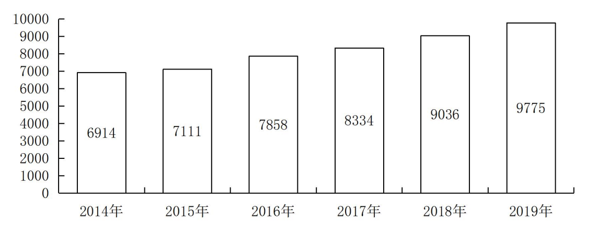

## 第一章 实用速算技巧

### 1.1 加法技巧——尾数法、高位叠加法、削峰填谷法

#### 1.1.1 尾数法

在多个数字精确和快速求和时，从“尾数”处入手，为保证精确与速度，一般可观察两位。

**图 1 2014～2019年年末全国残疾人康复机构数量**

**【例 1】** 找出 2014～2017 年全国残疾人康复机构数量之和（末两位）

**【例 2】** 找出 2016～2019 年全国残疾人康复机构数量之和（末两位）

### 1.1.2 高位叠加

和我们记忆中的列竖式做加法技巧正相反，高位叠加是从高位加起，抓住问题的关键矛盾。非精确需求和没有选项可以参考时，可以使用高位叠加法。

**图 2014～2021年全国零售药店终端药品销售额和同比增速**

**【例 1】** 找出十三五时期全国零售药店终端药品销售额：

**【例 2】** 找出 2014-2018 年间全国零售药店终端药品销售额：

**【例 3】** 2014～2021 全国零售药店终端药品销售额之和约为多少亿元：

A. 2.82

B. 2.94

C. 3.02

D. 3.15

### 1.1.3 削峰填谷法

比如有 80.6、80.2、80.7、80.5 求平均数， 可以先拿掉80，小数点相加等0.48 ，比较选项
