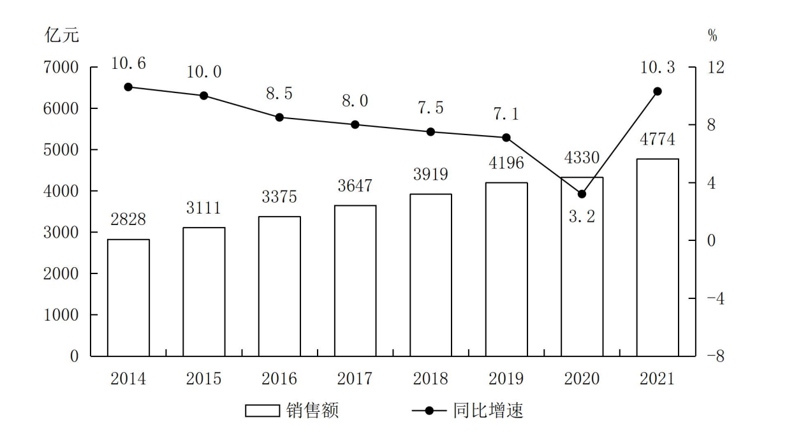

## 第一章 实用速算技巧

### 1.1 加法技巧——尾数法、高位叠加法、削峰填谷法

#### 1.1.1 尾数法

在多个数字精确和快速求和时，从“尾数”处入手，为保证精确与速度，一般可观察两位。

**图 1 2014～2019年年末全国残疾人康复机构数量**

**【例 1】** 找出 2014～2017 年全国残疾人康复机构数量之和（末两位）

**【例 2】** 找出 2016～2019 年全国残疾人康复机构数量之和（末两位）

### 1.1.2 高位叠加

和我们记忆中的列竖式做加法技巧正相反，高位叠加是从高位加起，抓住问题的关键矛盾。非精确需求和没有选项可以参考时，可以使用高位叠加法。

**图 2014～2021年全国零售药店终端药品销售额和同比增速**

**【例 1】** 找出十三五时期全国零售药店终端药品销售额：

**【例 2】** 找出 2014-2018 年间全国零售药店终端药品销售额：

**【例 3】** 2014～2021 全国零售药店终端药品销售额之和约为多少亿元：

A. 2.82

B. 2.94

C. 3.02

D. 3.15

### 1.1.3 削峰填谷法

比如有 80.6、80.2、80.7、80.5 求平均数， 可以先拿掉80，小数点相加等0.48 ，比较选项

## 1.2  减法技巧--整数基准法、"21" "12" 分段法

### 1.2.1 整数基准法

减数减一减数 = (减数减一基准值) + (基准值减一减数)；

例如 "632-589"，我们可以加入 600 作为基准值，则 632-589 = (632-600) + (600-589)。

### 1.2.2 "21" "12" 分段法

将三位数的减法分成 "21" 或 "12" 两段，尽可能保证不用借位。

**【例题】**

512 - 481

532 - 328

721 - 688

745 - 372

938 - 776

822 - 484

939 - 842

892 - 784

822 - 794

## 【例1】（2023年考）

2021年2～12月月末固定互联网宽带接入用户数

|  |  接入用户 | 其中：xDSL用户 | 其中：光纤用户 | 其中：100Mbps速率以上用户 |
|---|---|---|---|---|
| 2月 | 49222 | 296 | 46274 | 44516 |
| 3月 | 49726 | 295 | 46707 | 45072 |
| 4月 | 50061 | 293 | 47053 | 45517 |
| 5月 | 50516 | 292 | 47515 | 46104 |
| 6月 | 50961 | 290 | 47968 | 46649 |
| 7月 | 51374 | 290 | 48416 | 47173 |
| 8月 | 51865 | 290 | 48921 | 47710 |
| 9月 | 52629 | 291 | 49643 | 48450 |
| 10月 | 53146 | 290 | 50077 | 49026 |
| 11月 | 53540 | 288 | 50466 | 49557 |
| 12月 | 53579 | 283 | 50551 | 49848 |

2021年下半年，我国固定互联网宽带接入用户中，光纤用户数量超过500万户的月份有几个：

A. 2
B. 3
C. 4
D. 5

**答案：D**

## 【例2】（2022年真考）

2011～2020年全国城市生活垃圾无害化处理状况

|  | 总清运量（万吨） | 无害化处理场（座） | 无害化处理能力（万吨/日） | 无害化处理量（万吨） |
|---|---|---|---|---|
| 2011年 | 16395 | 677 | 40.91 | 13090 |
| 2012年 | 17081 | 701 | 44.63 | 14490 |
| 2013年 | 17239 | 765 | 49.23 | 15394 |
| 2014年 | 17860 | 818 | 53.35 | 16394 |
| 2015年 | 19142 | 890 | 57.69 | 18013 |
| 2016年 | 20362 | 940 | 62.14 | 19674 |
| 2017年 | 21521 | 1013 | 67.99 | 21034 |
| 2018年 | 22802 | 1091 | 76.62 | 22565 |
| 2019年 | 24206 | 1183 | 86.99 | 24013 |
| 2020年 | 23512 | 1287 | 96.35 | 23452 |

2012～2020年间，全国城市生活垃圾无害化处理量同比增长超过1200万吨的年份有几个：

A. 4
B. 5
C. 6
D. 7

**答案：B**

## 1.3 乘法技巧一-小分数、拆分法

### 1.3.1 小分数

若乘法中某个乘数可以以简单的化分数形式出现，我们就可以将多位数乘法转化为简单算法计算。

**需记忆的常用小数如下：**

- 50% = 1/2
- 33.3% = 1/3
- 25% = 1/4
- 20% = 1/5
- 16.7% = 1/6
- 14.3% = 1/7
- 28.6% = 2/7
- 42.9% = 3/7
- 12.5% = 1/8
- 11.1% = 1/9

**[例题]**

- 784 x 25%
- 632 x 12.5%
- 727 x 16.7%
- 981 x 33.3%
- 20% x 455
- 50% x 472

## 1.3.2 乘法拆分

若乘法中某个乘数为百分数且能拆成两个简单数值（50%、10%、5% 等），我们可以将该百分数拆成两个部分，要遵循“1%（“一个包干”）”。

**常用的拆分方法如下：**

- 45% = 50% - 5%
- 55% = 50% + 5%
- 15% = 10% + 5%
- 60% = 50% + 10%
- 95% = 1 - 5%
- 90% = 1 - 10%

以及所有 50%、100%  附近的数字等等。

## [例题]

- 382 x 55%
- 492 x 48%
- 936 x 45%
- 592 x 97%
- 1228 x 95%
- 766 x 103%

## [例 1] 62851 x 97.2% = ?

A. 60671
B. 61091
C. 61692
D. 62052

## [例 2] 42815 x 93.1% = ?

A. 41481
B. 40819
C. 39861
D. 39012

## [例 3] 91285 x 51.1% = ?

A. 46647
B. 47218
C. 44512
D. 45628

## [例 4] (2023 年 青海)

2021 年，我国消费最多的母婴商品金额约为：

A. 9638 亿元
B. 8994 亿元
C. 7852 亿元
D. 4186 亿元
