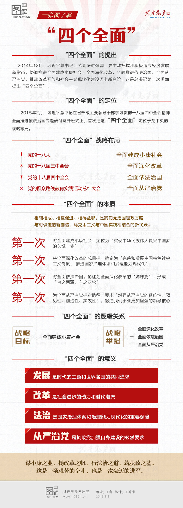

# 四个全面

## 具体内容

+  全面建成小康社会【2020年底实现全面脱贫】 
    - 2012年12月参观《复兴之路》展览
+  全面深化改革 
+  全面依法治国 
    -  纪念“八二宪法”颁行 
    -  八二宪法主要内容包括:  
       将国家性质由“无产阶级专政”恢复为“人民民主专政”;将知识分子与工人、农民并列为三支基本的社会力量;恢复设立国家主席;中央军委主席改由全国人大选举;国务院实行总理负责制;规定国家、全国人大、国务院领导人连续任职不得超过两届,取消了领导职务的终身制;新增“公民的人格尊严不受侵犯”的条文;承认国营、集体、个体三种经济都不可缺少,申明国家保护个体经济的合法权益等。 
+  全面从严治党 
    - 制定“八项规定”

## “四个全面”布局

## 全面建成小康社会

“全面建成小康社会具体包含了五个方面的目标，一是经济发展方式得到根本转变，建成世界经济强国;二是社会建设取得显著进展，建成社会主义和谐社会;三是政治文明建设取得重要进展，建成社会主义民主国家;四是文化建设大繁荣、大发展，建成社会主义文化强国;五是生态文明建设进入新阶段，初步建成绿色中国。”

**要坚决打好防范化解重大风险、精准脱贫、污染防治的攻坚战。**

## 全面深化改革

《[中共中央关于全面深化改革若干重大问题的决定](https://baike.baidu.com/item/%E4%B8%AD%E5%85%B1%E4%B8%AD%E5%A4%AE%E5%85%B3%E4%BA%8E%E5%85%A8%E9%9D%A2%E6%B7%B1%E5%8C%96%E6%94%B9%E9%9D%A9%E8%8B%A5%E5%B9%B2%E9%87%8D%E5%A4%A7%E9%97%AE%E9%A2%98%E7%9A%84%E5%86%B3%E5%AE%9A/12276370)》紧紧围绕经济、政治、文化、社会、生态文明、党建等六大改革主线，涵盖15个领域、包括60个具体任务。《决定》指出，经济体制改革是全面深化改革的重点，核心问题是处理好政府和市场的关系，使市场在资源配置中起决定性作用和更好发挥政府作用。

### **1****、经济制度**

**核心表述：公有制经济和非公有制经济都是社会主义市场经济的重要组成部分。**  
　　a、完善产权保护制度，提出公有制经济财产权不可侵犯，非公有制经济财产权同样不可侵犯。  
　　b、积极发展混合所有制经济，推动国有企业完善现代企业制度，支持非公有制经济健康发展。  
　　**2****、市场体系**  
　　**核心表述：凡是能由市场形成价格的都交给市场，政府不进行不当干预。**  
　　a、建立公平开放透明的市场规则：实行统一的市场准入制度。  
　　b、推进水、石油、天然气、电力、交通、电信等领域价格改革，放开竞争性环节价格。  
　　c、允许农村集体经营性建设用地出让、租赁、入股，实行与国有土地同等入市、同权同价。  
　　d、允许具备条件的民间资本依法发起设立中小型银行等金融机构。  
　　e、改革院士遴选和管理体制，实行院士退休和退出制度。

###　**3****、政府职能**  
　　**核心表述：增强政府公信力和执行力，建设法治政府和服务型政府。**  
　　a、最大限度减少中央政府对微观事务的管理，市场机制能有效调节的经济活动，一律取消审批。  
　　b、理顺部门职责关系。积极稳妥实施大部门制。  
　　c、优化行政区划设置，有条件的地方探索推进省直接管理县（市）体制改革。

### **4****、财税体制改革**

**核心表述：建立事权和支出责任相适应的制度，适度加强中央事权和支出责任。**  
　　a、建立规范合理的中央和地方政府债务管理及风险预警机制。  
　　b、增加对革命老区、民族地区、边疆地区、贫困地区的转移支付。  
　　b、逐步提高直接税比重。把高耗能、高污染产品及部分高档消费品纳入消费税征收范围。  
　　c、加快房地产税立法并适时推进改革，加快资源税改革，推动环境保护费改税。  
　　d、进一步理顺中央和地方收入划分。

### **5****、城乡一体化**

**核心表述：让广大农民平等参与现代化进程、共同分享现代化成果。**  
　　a、赋予农民对承包地占有、使用、收益、流转及承包经营权抵押、担保权能，允许农民以承包经营权入股发展农业产业化经营。  
　　b、改革完善农村宅基地制度，选择若干试点，慎重稳妥推进农民住房财产权抵押、担保、转让。  
　　c、保障农民工同工同酬，保障农民公平分享土地增值收益。  
　　d、合理确定大城市落户条件，严格控制特大城市人口规模。全面放开建制镇和小城市落户限制，有序放开中等城市落户限制。

### **6****、开放型经济**

**核心表述：放宽投资准入，统一内外资法律法规，保持外资政策稳定、透明、可预期**  
　　a、在上海自由贸易区试点基础上，选择若干具备条件地方发展自由贸易园（港）区。  
　　b、支持内陆城市增开国际客货运航线，发展多式联运。  
　　c、允许沿边重点口岸、边境城市、经济合作区在人员往来、加工物流、旅游等方面实行特殊方式和政策。  
　　d、扩大对香港特别行政区、澳门特别行政区和台湾地区开放合作。

### **7****、政治制度**

**核心表述：发挥人民代表大会制度的根本政治制度作用。**  
　　a、健全立法起草、论证、协调、审议机制，提高立法质量，防止地方保护和部门利益法制化。  
　　b、加强人大预算决算审查监督、国有资产监督职能。落实税收法定原则。  
　　c、发展基层民主，健全基层选举、议事、公开、述职、问责等机制。

### **8****、法治建设**

**核心表述：维护宪法法律权威。让人民群众在每一个司法案件中都感受到公平正义。**  
　　a、普遍建立法律顾问制度。完善规范性文件、重大决策合法性审查机制。  
　　b、减少行政执法层级，加强食品药品、安全生产、环境保护、劳动保障、海域海岛等重点领域基层执法力量。理顺城管执法体制，提高执法和服务水平。  
　　c、确保依法独立公正行使审判权检察权。推进审判公开、检务公开。  
　　d、严禁刑讯逼供、体罚虐待，严格实行非法证据排除规则。逐步减少适用死刑罪名。  
　　e、废止劳动教养制度，完善对违法犯罪行为的惩治和矫正法律，健全社区矫正制度。

### **9****、反腐败**

**核心表述：让权力在阳光下运行，是把权力关进制度笼子的根本之策。**  
　　a、加强和改进对主要领导干部行使权力的制约和监督。  
　　b、强化上级纪委对下级纪委的领导。查办腐败案件以上级纪委领导为主，线索处置和案件查办同时必须向上级纪委报告。  
　　c、全面落实中央纪委向中央一级党和国家机关派驻纪检机构。  
　　d、规范并严格执行领导干部工作生活保障制度，探索实行官邸制，官员任期内居住无产权。

### **10****、文化体制改革**

核心表述：推动政府部门由办文化向管文化转变  
　　a、建立党委和政府监管国有文化资产的管理机构，实行管人管事管资产管导向相统一。  
　　b、健全网络突发事件处置机制，整合新闻媒体资源，推动传统媒体和新兴媒体融合发展。推动新闻发布制度化。  
　　c、严格新闻工作者职业资格制度，重视新型媒介运用和管理，规范传播秩序。  
　　d、降低社会资本进入门槛，允许参与对外出版、网络出版。允许制作和出版、制作和播出分开。

### **11****、社会事业改革**

**核心表述：解决好人民最关心最直接最现实的利益问题**  
　　a、实行公办学校标准化建设和校长教师交流轮岗，不设重点学校重点班，破解择校难题，标本兼治减轻学生课业负担。  
　　b、探索招生和考试相对分离、学生考试多次选择、学校依法自主招生、从根本上解决一考定终身的弊端。  
　　c、探索全国统考减少科目、不分文理科、外语等科目社会化考试一年多考。  
　　d、改革机关事业单位工资和津贴补贴制度，完善艰苦边远地区津贴增长机制。  
　　e、适时适当降低社会保险费率。研究制定渐进式延迟退休年龄政策。  
　　f、取消以药补医，理顺医药价格。允许医师多点执业，允许民办医疗机构纳入医保定点范围。  
　　g、启动实施一方是独生子女的夫妇可生育两个孩子的政策。

### **12****、创新社会治理**

**核心表述：加强对社会组织和在华境外非政府组织的管理**  
　　a、改革信访工作制度，实行网上受理信访制度，建立涉法涉诉信访依法终结制度。  
　　b、完善统一权威的食品药品安全监管机构，建立食品原产地可追溯制度和质量标识制度。  
　　c、设立国家安全委员会，完善国家安全体制和国家安全战略，确保国家安全。

### **13****、生态文明**

**核心表述：建立系统完整的生态文明制度体系，用制度保护生态环境。**  
　　a、对限制开发区域和生态脆弱的国家扶贫开发工作重点县取消地区生产总值考核。  
　　b、探索编制自然资源资产负债表，对领导干部实行自然资源资产离任审计。  
　　c、实行资源有偿使用制度和生态补偿制度。  
　　d、改革生态环境保护管理体制。

### **14****、国防和军队**

**核心表述：着力解决制约国防和军队建设发展的突出矛盾和问题。**  
　　a、调整改善军兵种比例、官兵比例、部队与机关比例，减少非战斗机构和人员。  
　　b、优化武装警察部队力量结构和指挥管理体制。  
　　c、深化预算管理、集中收付、物资采购和军人医疗、保险、住房保障等制度改革。  
　　d、引导优势民营企业进入军品科研生产和维修领域。

### **15****、党的领导**

**核心表述：坚决维护中央权威，保证政令畅通。**  
　　a、中央成立全面深化改革领导小组，负责改革总体设计、统筹协调、整体推进、督促落实。  
　　b、推行公务员职务与职级并行、职级与待遇挂钩制度，完善基层公务员录用制度，在艰苦边远地区适当降低进入门槛。  
　　c、正确处理中央和地方、全局和局部、当前和长远的关系，正确对待利益格局调整。

## 全面依法治国

**1、依法治国是坚持和发展中国特色社会主义的本质要求和重要保障]**([http://www.12371.cn/special/xjpzyls/qmyfzg/1/](http://www.12371.cn/special/xjpzyls/qmyfzg/1/))  
**2、坚持中国特色社会主义法治道路，最根本的是坚持中国共产党的领导**  
**3、推进科学立法，完善以宪法为统帅的中国特色社会主义法律体系**  
**4、严格依法行政，加快建设法治政府**  
**5、坚持公正司法，努力让人民群众在每一个司法案件中都能感受到公平正义**  
**6、增强全民法治观念，使尊法守法成为全体人民共同追求和自觉行动**  
**7、建设一支德才兼备的高素质法治队伍**  
**8、全面依法治国，必须抓住领导干部这个“关键少数”**

## 全面从严治党

### 1.全面从严治党新思维：把纪律刻印全体党员心上

### 2.八项规定改变中国

### 3.沉甸甸的防腐成绩单：“打虎拍蝇猎狐” “铁腕反腐”

### 4.深化党内教育：让每个党员不忘初心继续前进

### 5.在行动中树立理想信念标杆：百年政党赤子之心

### 6.强化党内监督

### 7.完善党内制度建设

### 8.不忘初心 继续前进：全面从严治党永远在路上
