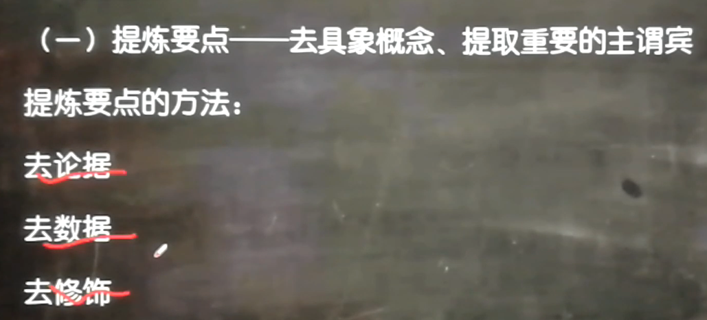
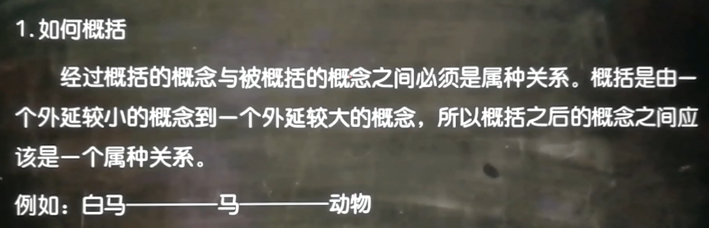
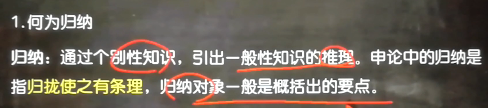
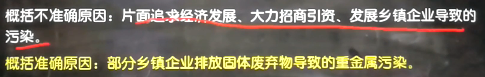
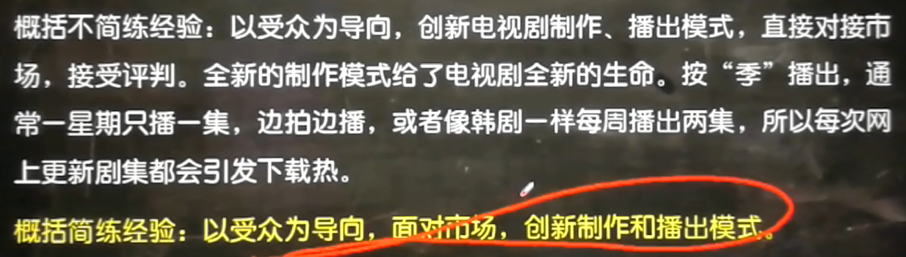
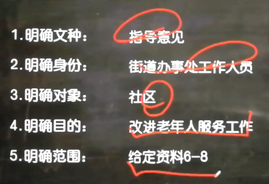
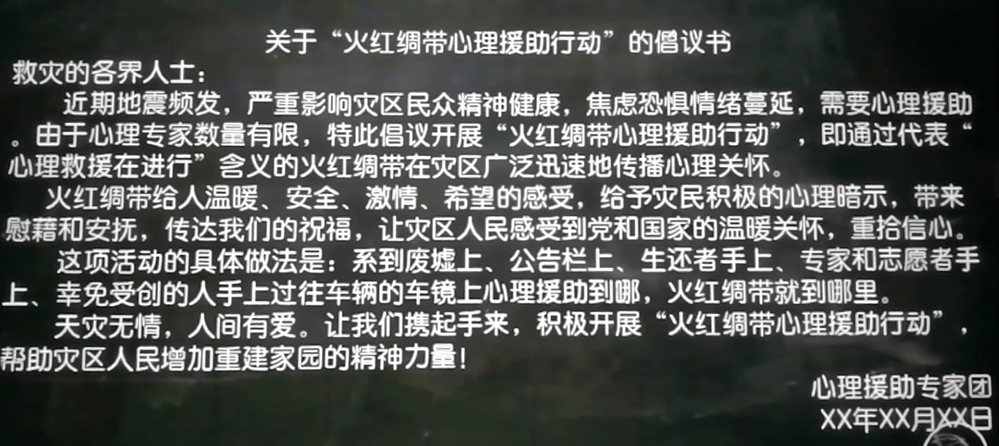
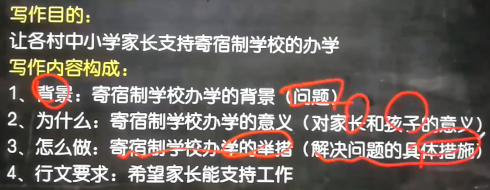
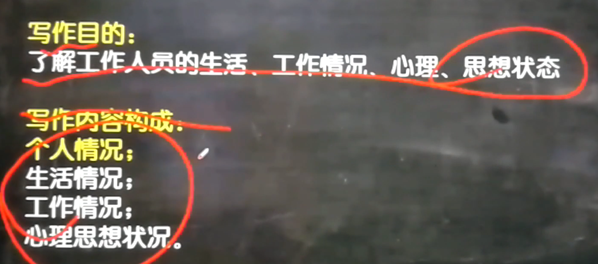

# 概况与归纳

## 目标一：学会阅读材料—抓主旨，抓观点
## 目标二：在读题中，明确命题意图             写什么，才契合题目所问
## 目标三：以不变应万变   申论题目的灵活性，“双印证”做题思路
+ 结合题目理解材料
+ 结合材料理解题目

## 概括归纳题，如何找要点？具体技巧
### 找观点句，提炼要点
+ 要有辨析细节句和观点句的意识（类比论据、论点）。
+ 观点句的位置多出现在断尾、段首，或者材料中领导说的话。
+ 
+ 
+ 
+ 
+ 

### 找关键句，归纳脑补要点
+ 高频词
+ 表达特点更抽象、规范

## 实例

## 例题

# 词句理解
## 答题步骤
+ 理解句子的含义：句子意在突出什么
+ 具体化：不同角度的即为不同的要点
+ 总结、启示
+ 最后整体看答题要点的内资逻辑

# 总结技巧
+ 如果是写措施、举措等。要是用 动词+关键词 ，如开展多种形式精神教育，注重榜样示范效应。而不是"加强精神教育"或者“强化榜样示范”，一般有“通过、为了、规定、切实”等动词
+ 如果是总结经验或者写启示，则需要体现普适性，千万不能出现具体的物件名称。一般答题技巧是：小帽子（高度总结）+如案例中的什么什么
+ 不要从很细节的地方找要点
+ 领导说的话一般是要点

# 客观题如何复盘？（复盘不是默写，复盘是理解别人为什么这么写，再写一遍来强化正确的做题思路）
+ 自己怎么做的？从题目理解、材料要点寻找、表达等方面看。
+ 别人怎么做的？差异在哪里》总结得失。
+ 规避自己缺点，博采众长，重新写一遍，看能否写出完美答案。

# 应用文写作
## 五明确

## 正文

## 倡议书

## 信件

## 调查问卷

