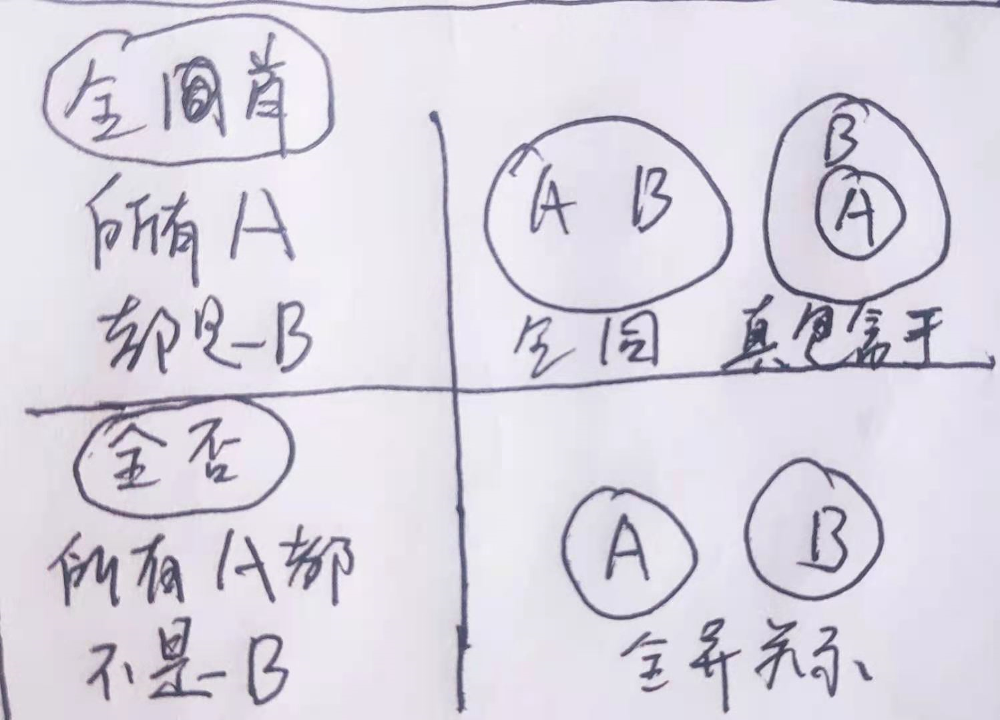

# 6.1 必然性推理
结论可以由前提必然推导出来

## 直言命题
也称简单命题

+ （量项）主项+联项+谓项
+ 直言命题的分类 六种
    - 全肯：所有A是B
    - 全否：所有A不是B
    - 特肯：有的A是B
    - 特否：有的A不是B
    - 单肯：a是B
    - 单否：a不是B
+ 直言命题的对当关系 不同直言命题之间在真假方面所存在的制约关系
    - 
    - 一个命题前面加**“并非”等值于这个命题的****矛盾命题**
+ 直言命题的变形推理
    - 换质推理
        * 双重否定表肯定
        * 例如：所有A是B—>所有A不是非B
        * 所有A不是B—>所有A是非B
    - 换位推理
        * 倒过来说
        * 所有A是B—>有些B是A
        * 所有A不是B—>有些B不是A
        * 有些A是B—>有些B是A
        * 有些A不是B—>不能换位

## 概念和三段论
+ 概念：构成命题和推理的基础，表达一类事物的词语才是概念。
+ 概念间的关系
    - 全同 外延完全相同
    - 真包含（于） 一个概念外延包含（于）另一个外延
    - 交叉关系
    - 全异关系
+ 三段论推理
    - 由两个直言命题作为前提，一个直言命题作为结论而构成的推理
    - 文氏图表示概念间的关系
    - 
    - 
    - 前提型三段论
        * 有且只能有三个不同的概念，且每个概念出现两次
        * 一特得特
        * 一否得否

## 复言命题
由两个或者多个单句通过联结词联结而成的命题

+ 联言命题与选言命题
    - 联言命题 多种情况同时存在，A并且B
    - 选言命题 至少有一种情况存在
        * 相容选言命题 A或者B
        *  不相容选言命题 要么A，要么B
    - 真假关系
        * A并且B 有假即假，全真才真  相当于与命题and
        * A或者B 有真则真，全假才假 相当于或命题or
        * 要么A，要么B 异或命题 有且仅有一真才为真
+ 假言命题
    - 带有假设条件的命题
    - 充分条件假言命题 如果A，那么B 只要~就 若~则
        * 肯前则肯后，否后则否前
        * A—>B = 非B—>非A
        * 原命题和其逆否命题等价
        * A真B假才为假 并非A—>B 等价于  A且非B
    - 必要条件假言命题 只有A，才B      A<—B  没有~就没有
        * 无A必无B，有B必有A
        * 否前则否后 肯后前肯前
        * A假B真才为假     并非A<—B   等价于   非A且B
    - 充分条件和必要条件的转化
        * /？？？

## 模态命题
含有“必然”“可能”

主要考察模态命题的矛盾关系及等值转化关系。

+ 矛盾关系
    - 必然A和可能非A 是一对矛盾命题 必有一真一假
    - 必然非A和可能A
+ 等值转化
    - ？？？
    - 在模态命题前加上“并非”。即为其负命题，与原命题具有矛盾关系
    - 并非“必然A”==“可能非A”  不必然==可能不
    - 并非“必然非A”==“可能A”   不必然不==可能
    - 并非“可能A”==“必然非A” 不可能==必然不
    - 并非“可能非A”==“必然A” 不可能不==必然

## 智力推理
+ 朴素逻辑
+ 假设、代入、排除法
+ 找解题切入点
+ 图表法

# 6.2 可能性推理
可能性推理是与必然性推理相对而言的，指的是结论不能由前提必然推导出来的推理。

## 削弱、加强型
+ 削弱：反驳题干
+ 加强：支持题干
+ 总体结构分析
    - 论据——>论点（结论）
+ 类比论证
    - 已知事物与跟它有某些相同特点的事物比较
    - 寻找二者的相似度
    - 分清楚 削弱还是加强
+ 强加因果
    - 给出两个事实，一个事实是另一个事实的原因
    - 即前提存在的事实A、事实B，结论强加因果关系，认为A导致B
+ 共变论证
    - 同中求变的论证方法
+ 缺桥论证
    - 论据与论点之间存在明显的跳跃，由题干论据不足以退出论点，需要增加一个隐含假设才能使论证成立。
    - “搭桥法”
    - 反向代入法
+ 原因分析
+ 数据比例 考查实质是考查部分与总体之间的关系
    - 要考虑样本的代表性
    - 考虑数据的可比性
+ 提出方法
    - 方法可行或者实施后能带到目的则加强，方法不可行或者实施后达不到目的则削弱
    - 方法达不到目的 比 方法不可行的削弱程度更强

## 结论型

归纳或者推理

## 评价型
+ 常规评价
    - 正确选项对题干论证起到正反两方面的评价作用
+ 结构比较
    - 如果题干涉及可能性推理，则分析题干和选项的论证方式
    - 如果是直言或者复言命题，则直接分析题干和选项的句子结构

## 解释型
从选项中找出最能合理的解释题干所述的一项，题干中描述大多是一个结论、现象、矛盾或者差异。

+ 正确选项必须能够解释现象或是矛盾发生的原因
+ 正确选项必须与题干现象或者矛盾相关，不能否定或者无视题干

## 选项分析
+ 识别迷惑项
+ 选项比较原则

