# 0 反思
## 20210518 行测问题
1. 阅读理解做题速度上不去
2. 阅读理解正确性需要提高，必须复习视频中的方法，严格按照视频中讲的方法来训练
3. 每天词语填空练习比少于4组，60个！
4. 每天阅读理解练习不少于2组，30个！
5. 每天语句表达练习不少于2组，30个！
6. 每天判断推理-图形推理不少于2组，30个！
7. 每天判断推理-逻辑判断不少于2组，30个！
8. 每天地理国情不少于4组，60个！

## 20210518 申论问题
1. 概括总结还没有明显提升，必须强化答题规范
2. 申论知识积累每天没有达标，每天必须精读1篇习近平讲话，学习3篇评论文章
3. 每天早起朗读学习强国金句10分钟！

# 1 言语
## 思维方式
+ 把握材料中重要的词语
+ 分析材料的行文结构
+ 理解材料中重要的句子

## 作答顺序
+ 问题
+ 提干
+ 选项

## 个人经验：
+ 当面临2选1时候，一定要找选项中的关键词，看关键词是否在文段中出现及出现频率
+ 对于句子填空题一定要把选好的句子带入文中检验，看句子行文是否流畅，有无明显别扭

## 言语理解与表达
### 概况
+ 包括阅读、理解、分析、归纳、总结
+ 逻辑填空
+ 阅读理解
+ 语句表达
+ 关键点：注意对策措施
+ 题量 30-40
+ 分值 0.8

### 学习方法
+ 语感素质
+ 阅读速度
+ 夯实基础提高语文敏锐性
    - 阅读训练
    - 词汇积累
    - 语感培养
+ 加快做题速度
    - 正向分析
    - 勇敢抉择

### 思维技巧
+ 掌握做题顺序
    - 看提问
    - 读材料
    - 辩选项
+ 掌握大意，细节决定
+ 关键词定位
+ 选择最佳答案

### 1.1 阅读理解
#### 考察能力：对文章主旨、中心的把握
#### 阅读理解思维方式
    - 把握材料中重要的词语
        * 关联词
        * 代词
        * 强调词
        * 高频词
    - 分析材料行文结构
        * 总分
        * 分总
        * 总分总
        * 分总分
        * 分分
    - 理解材料中重要的句子
        * 中心句
        * 总结句
        * 过渡句

#### 作答顺序
    - 题干
    - 问题
    - 选项

#### A 主旨意图
+ 问题：主要、主旨、意在、中心、核心、概括
+ 关键词
    - 关联词：
        * 转折关键在但是之后 重点
        * 因果关键在结果：造成、导致、归咎于（后面是原因）
        * 条件关键在对策
        * 假设关键在假设条件
        * 递进关键是递进之后的内容
    - 强调词
        * 应当、务必、事实上、总而言之
        * 意味着、专家认为、调查显示
    - 高频词
    - 倾向性
        * 片面、可惜、遗憾的是
    - **转折类题目** 转折之后市重点  总结问题要优先选择解决问题的对策
    - **因果类题目** 结论是重点
    - **条件关联词 **只有---才 必要条件是重点，如必须，需要，应当，前提、保障、亟待
    - **假设关联词** 如果、一旦、除非、否则  假设的内容是重点，如果假设内容是负面的，则选择假设内容相反的内容
    - **递进关联词  **不仅，而且，最 正是，恰恰是 重点内容是递进后的内容
+ 行文脉络与关键句
    - 分总。总分。分分。分总分。总分总
    - 总述句或者分述句
    - 关键句
        * 首尾句 观点或者对策
        * 中心句
+ 关键是选择对策

#### B 细节理解
+ 提问方式：
    - 符合文意
    - 对这段文字理解最准确的是
    - 说法不正确的是
+ 做题顺序
    - 先读文段 知道主旨
+ 常见出题陷阱
    - 偷换概念——>主语、谓语与原文是否一致
    - 混淆时间——>准确把握“已然与未然，或然与必然”
    - 颠倒黑白——>选项信息与原文对照即可
    - 无中生有——>选项内容是否在原文中能找到依据或者推测
    - 推断错误——>内容有着落、推断有规律
    - 以偏概全——>词语前的修饰词、限定词
    - 逻辑错误——>找出分句与关联词，与原文进行对照

#### C 词句理解
+ 词语理解 
+ 句子理解
+ 提问方式
    - 对文中XX喻意理解最正确的是
    - 对文中XX理解有误的是
    - XX的含义是
    - 文段中加点的XX指代
+ 解答技巧
    - 把握主旨
    - 文体特点
    - 注意位置
    - 前后勾连，表里参验 

#### D 标题提炼
+ 提问方式
    - 最适合做本段文字标题的是
    - 作为引言，该文段最可能谈的是
+ 答题要求
    - 记述文——>标题涵盖文段的全部内容，标题与文段主题一致
    - 说明文——>抓准说明对象
    - 议论文——>抓住论点
    - 新闻——>简练、具体而平实、不遗漏核心信息

### 1.2 语句表达：说多不会
+ 题型：语句衔接、结语推断、语句排序
+ 考察能力：行文结构准确把握，表达的规范性和准确性

#### A 语句衔接
+ 通顺流畅
+ 承上启下
+ 主旨大意：对策或者结论

#### B 结语推断
+ 关注尾句
    -  提一个概念、只一种现象、提一个问题
+ 排除法
    - 前文信息、无关信息 
+ 好上更好，让坏的怎么变好
+ 两个选项都可以，则选择范围更大的那个

#### C 语句排序
+ 具体方法：
    - 首尾句法
        * 首句，背景或者定义。
        * 尾句：不是对策就是结论。
        * 有代词的不能做首句
    - 关联词法：要挨在一起
    - 指代词法：
    - 逻辑顺序：  

### 1.3 逻辑填空：遣词造句的艺术
#### A 实词解析
+ 词语中含有实际意义的词语

#### B 虚词辨析
+ 没有完整的词汇意义，最常用关联词
+ 关联词
    - 并列：前后语义一致，可调换。如既···又···，同时，一边，是···也是
    - 递进：更近一层，不但···而且，尚且···何况（更不用说），尤其，甚至
    - 转折：虽然···但是，但是，但，然而，只是，不过

#### C 成语辨析 
+ 一定要把日常用错的成语积累起来

### 1.4 篇章阅读
+ 思维方式
    - 把握材料中重要的词语
    - 分析材料行文结构
    - 理解材料中重要的句子
+ 作答顺序
    - 问题
    - 材料
    - 选项

# 2 判断推理
## 2.1 图形推理
### 经验总结
+ 遇到日子变形图要考虑笔画数（几笔画成）
+ 遇到曲线和直线图形，首先考虑曲线直线数量关系，在观察曲线直线交点
+ 图中出现等腰元素，则考虑对称性
+ 图中都是开放图形，则一直开放

### 位置类
+ 观察题目
    - 图形是否相似
        * 图形中位置有何规律
        * 图形或元素是否有叠加规律
        * 图形中元素种类是否发生变化
        * 图形是否对称
        * 封闭性
        * 相对位置
    - 元素种类和数量
        * 元素类别
        * 元素位置
        * 元素数量
+ 识别方法：观察题干中的图形组成元素相同和图形位置变化明显
+ 位置变化（组成元素完全相同）
    - 平移（上下左右顺逆时针步数）横着移竖着移转着圈移
    - 旋转（45、90）不改变图形的时针方向
    - 翻转（镜面）改变时针方向，不能旋转得到
    - 相对位置：相离（内含、外离）、相交、覆盖
+ 九宫格解题：
    - 第一行找规律（图形位置变化、元素数列、奇点数）
    - 第二行验证规律
    - 第三行解题
+ 九宫格中中间图形和其他都不相同，则是米字型变化规律

### 属性类
+ 识别方法：观察题干中的图形组成元素相似
+ 对称性：
    - 轴对称（对折后完全重合）
    - 中心对称（只有一个对称中心）
    - 黑白小球也可以考虑对称性
+ 曲直性
    - 直线（三角形、正方形）
    - 曲线（圆、椭圆等）
+ 封闭性
    - 开放图形
    - 封闭图形 

### 叠加类
+ 观察题干中的图形组成，其部分结构相同，但不完全相同
+ 直接叠加
+ 去同存异
+ 去异存同
+ 黑白叠加等

### 数量类
+ 通常情况，一个图形都是由点、线、角、面、素这几种元素组成
+ 点：交点（切点）和拐点，注意交点个数（直线和图形的交点、直线和曲线交点、直线和直线的交点、曲线和曲线的交点）
+ 线：直线和曲线
+ 角：锐角、直角和钝角（很少考！角不重复）
+ 面：封闭性
+ 素：元素个数、种类、元素的运算
+ 笔画数：图形或汉字由几笔构成
+ 一笔画：
    - 必须是连贯的没有断开的部分
    - 奇点数是0或者2，或者说有两个奇点或全是欧点
    - 多笔画：笔画数=奇点数/2

### 空间重构类
+ 两种题型：折纸盒与拆纸盒问题
+ 主要考察：事物之间相互联系 ，主要四相邻面公共线、公共点、想对面、相邻面的细节
+ 做题顺序：
    - 先用相对面（中间隔一整行或者一整列）排除两个答案
    - **顺时针数面**，正对面在中间，上1，右2，下3，左4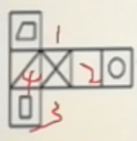
    - 用公共点判断
    - 用公共边排除对公共边进行顺时针编号，上1右2下3左4，特别注意相邻面图形特征（边上的点或者特殊特殊图案朝向）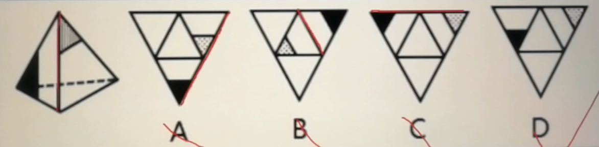四面体拉直后为相邻边，比如C项上部为黑色尖块和灰色尖块的相邻边
    - 小立方体块拼接：
        * 第一步看完整图形每层的立方体块数
        * 看给出的两个（或三个）立方体，每一层之和是多少
        * 找出选项中，刚好能与第二步中立方体每层块数之和与完整图对应的选项

## 2.2 类别推理
+ 题型：两词类比、三词类比、填空
+ 考察能力：推理能力、分析能力及词语积累和常识
+ 词间关系：逻辑关系（并列、因果、范围包含（数学集合，包含、不包含、交叉））

### 语义关系
+ 语法关系
+ 词义关系
+ 三词关系时候，进行造句，看哪一组最合适。

### 描述关系
+ 与事务相关
+ 与人相关
+ 与作品相关
+ 与历史相关
    - 金庸小说：飞雪连天射白鹿,笑书神侠倚碧鸳

### 概念间关系
+ 全同关系：同一事物不同称谓，古今中外雅俗
+ 包含关系：A是B
+ 交叉关系：我中有你，你中有我
+ 并列关系：同属一个大类，或者有某种共同属性

### 逻辑关系（造句 ）
+ 因果关系
+ 条件关系
+ 顺承关系 

## 2.3 定义判断
+ 明确概念的内涵和外延
+ 概念所反映的事物对象所具有的本质属性
+ 概念的外延是指这个概念所反映的事物对象的范围

### 三个原则
+ 尊重题干
+ 抓准“关键”
+ 紧扣定义

### 两个方法
+ 关键要素分析法
+ 选项对比法 

## 2.4 逻辑判断
### 必然性推理
+ 从真前提能够必然地推出真结论的的推理
+ 考查内容：直言命题（简单命题），负命题，联言命题（p且q），选言命题（p或q），假言命题（如果p则q）
+ 方法：图表法，德摩根定律，翻译法
+ 经验
    - 矛盾命题必然一真一假
    - 把有大于或者小于等于的转为数学语言，用不等式知识进行求解

#### 直言命题
+ 断定事物是否具有某种性质的简单命题
+ 一般表示：所有（有的）S是（不是）P
+ 常用解题方法：文氏图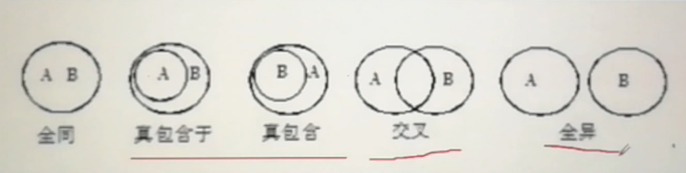

#### 负命题
+ 否定一个命题
+ 标准形式：并非p。非p
+ 负简单命题等价形式（所有变有的，是变为不是）
    - 并非所有S都是P==有的s不是p
    - 并非所有S不是p==有的s是p
    - 并非有的s是p==所有s不是p
    - 并非有的s不是p==所有s都是p

#### 联言命题（）
+ 反映事物若干种情况或者性质同时存在的命题
+ 标准形式：p并且q
+ 连接词：和，不但而且，虽然但是，不是而是，表并列，递进，转折，顺承

#### 选言命题（选择关系）
+ 至少有一种存在
+ 标准形式：p或者q；要么p，要么q
+ 看是否有并存关系
    - 相容选言命题（两个命题都可以成立）：或，或（者）或（者），可能也可能，也许也许
    - 不相容（二者不能兼得）：或者或者，不是就是，要么要么

#### 真命题
+ p且q 同时为真
+ p或者q 至少有一个为真
+ 要么p，要么q  有且只有一个为真

#### 负命题
+ 德摩根定律（去括号是 加非 且变或  或变且）
    - 非（p且q） == 非p 或 非q
    - 非（p或q） == 非p 且 非q

#### 假言命题
+ 前件p，后件q
+ 三种形式：
    - 充分条件 前推后
    - 必要条件 后推前
    - 充要条件 前后互推
+ 充分条件：
    - 如果那么；只要就；若则；因为所以；一旦就；所有都
    - 肯定前件必肯定后件
    - 否定后件必否定前件
    - p—>q <=> -q—>-p （逆否命题 同真同假）
+ 必要条件：？？
    - 只有p，才q；q—>p
    - 只有才；除非否则不；没有就没有；不不；是的基础假设前提关键；是的必要先决不可或缺
    - 肯后必肯前
    - 否前必否后
    - p<—q <=> -q<—-p

### 或然性推理
+ 从前提只能或然地（并非必然地）推出真结论
+ 考查内容：论点、论据、论证方式
+ 题型：削弱型、加强型、解释型、结论型、评价型
+ 做题经验：
    - 找出论点
    - 必须注意论点中的限定词
    - 这是逻辑题，一定要抠字眼

#### 论证结构
+ 论据：立论的根据，证据
+ 论点：观点
+ 论证方法：归纳、因果、跳跃、类比

#### 削弱型
+ 削弱、质疑、反驳
+ 直接质疑论点最能削弱，直接反驳
+ 其次是质疑论证方式，推不出
+ 最后是质疑论据，虚假

#### 加强型
+ 哪项为真，最能支持或者加强上述观点或断定
+ 答案不需要充分性，只要使答案成立或者正确就可以

#### 解释型题目
#### 结论型题目（细节理解）
#### 评论型（逻辑形式）
# *3 数量关系
+ 重点在关系，必须用方法技巧，减少运算时间
+ 没有思路则直接跳过

## 自然数（奇偶性、质数和倍数；一定是整数！！！）
### 奇数、偶数、奇偶性
+ 奇数不能被偶数整除
+ 奇数乘奇数=奇数
+ 奇数+-奇数=偶数
+ 奇数+-偶数=奇数
+ 偶数+-偶数=偶数

### 质数、合数
+ 最小的质数是2，最小的合数是4，连续的两个质数是2、3。
+ 每个合数都可以由几个质数相乘得到，质数相乘一定是合数
+ 20以内的质数：有8个（2，3，5，7，11,13,17,19）
+ 100以内有25个质数（看是否是2，3，5，7,11,13的倍数）
+ 23,29,
+ 31,37,
+ 41,43,47
+ ,53,59,
+ 61,67,
+ 71,73,79,
+ 83,89,
+ 97
+ 质数中如果不算2，则所有其他质数之和为奇数
+ 质数中如果不算2，则所有质数之积为奇数。如果是偶数，则只能是包含了质数2

### 尾数性质
+ 两数之和的尾数=尾数之和的尾数
+ 两数之差的尾数=尾数之差的尾数
+ 两束之积的尾数=尾数之积的尾数

### 倍数特性
+ 能被5整除-----末位为0、5，如10,55
+ 能被8整除-----末三位可被8整除，如11240,1064
+ 能被3整除-----各位数字之和是3的倍数，如87，111
+ 能被9整除-----各位数字之和是9的倍数，如8181,1818,369
+ 能被6整除-----能同时被2、3整除（也就是被3整除的偶数），如84，72
+ 能被7整除-----末三位与其前面部分的差能被7整除，如7077
+ 能被11整除----一个数由右向左数，奇位数字与偶位数字和之差能被11整除，如
+ 重要性质：
    - 传递性：a能被b整除，b能被c整除，则a能被c整除
    - 可加减：a能被c整除，b能被c整除，则a+b，a-b均能被c整除

### 最大公约数和最小公倍数
+ 最大公约数：约分
+ 最小公倍数：通分

### 赋值法
+ 设1,100，最小公倍数
+ 用于工程问题、浓度问题求解

### 代入排除法
+ 万能方法，速度慢
+ 遇到较难计算的，可考虑用带入排除法

## 方程法
+ 最常用，但费时间
+ 存在明显的等量关系

## 极端分析法
### 最值
#### 至少（其他向下取1，即x-1）
+ 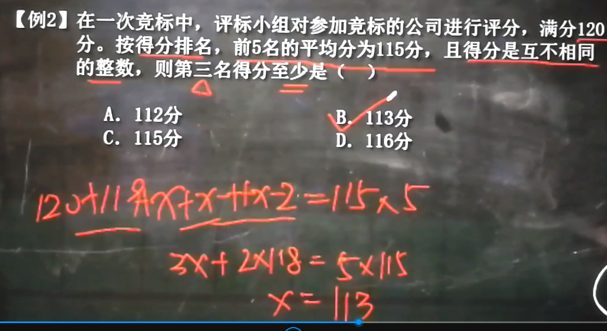
    - 设第三名最少为x，则其他四名都最多，即第一名为120，第二名为119，第三名为x，第四名为x-1，第五名为x-2
+ 
    - 设行政部门最少分x名，由于本题没有说其他6个部门分的人数是否相同，则设其他6个部门都是x-1，即x+6（x+1）=65，解得x=10.1，则至少为11
+ 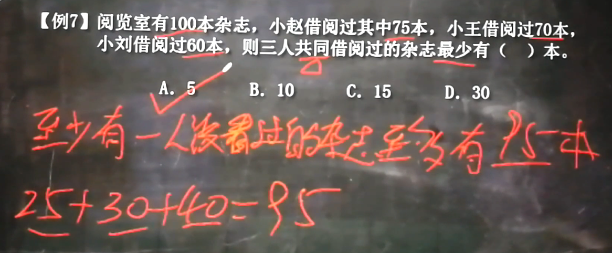
+ 转换为对立面，至少有一人没看过的杂志最多有____本。

#### 至多 （其他向上取1，即x+1）
+ 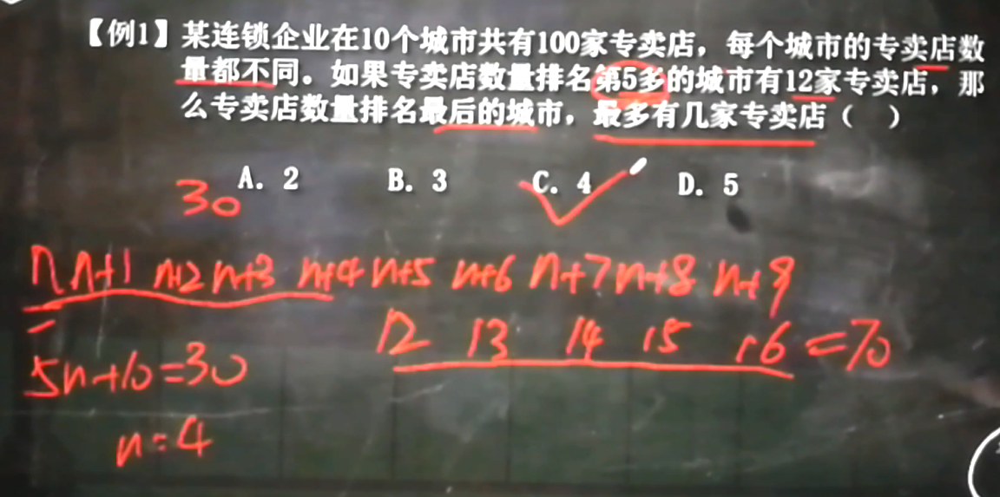
    - 设最后一个最多有x个，那么其他都最少，也就是刚刚比x对1，即第10名为x，第九名为x+1，第八名x+2，第七名x+3，第六名x+4，第5名x+5，第4名x+6，第3名x+7，第2名x+8，第1名x+9。第五名为12，则第4-1名为13,14,15,16，即第1-5名共有12+13+14+15+16=70家，则第6-10名有100-70=30，即x+(x+1)+(x+2)+(x+3)+(x+4)=30 解的x=4
+ 
    - 5*29-4*24=49 让其他四个人年龄最小都是24
+ 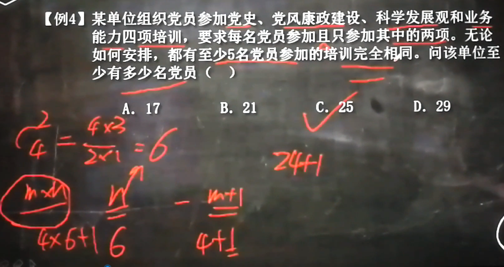
    - 4选2一共有6种，看陈6个抽屉，只需要每个抽屉放4名党员，然后在放1名，即6*4+1=25

### 抽屉原理

### 最不利（最倒霉情况）
+  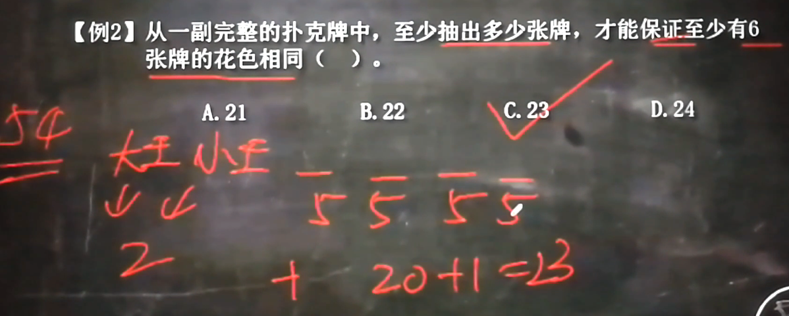
    - 一副牌中大王小王，黑红梅方，最倒霉情况，我第一张抽了大王，第二张抽了小王，黑桃抽了5张，红桃抽了5张，梅花抽了5张，方片抽了5张。即2+5+5+5+5=22次，那么23次一定能抽到一张和前面的花色相同。
+ 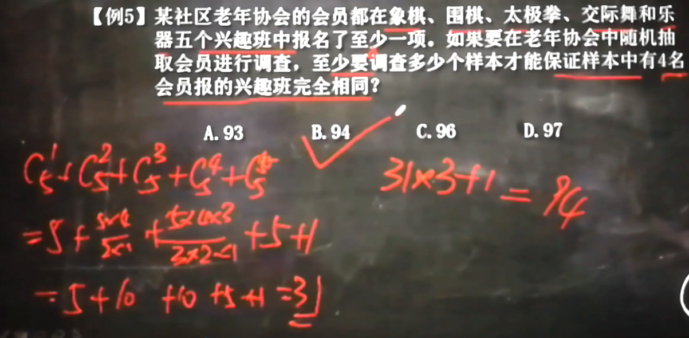
    - 先计算一共有多少种报名方式，$ C_{5}^{1} + C_{5}^{2} +C_{5}^{3}+ C_{5}^{4} +C_{5}^{5}  $=31中，则根据最不利法则，每种情况都是3个人，则有3*31=93中，则第93+1次一定会有完全相同的

## 图示化
+ 行程问题（线段）、年龄问题（文氏）、容斥问题（几何）
+ 线段、文氏图和几何图形
+ 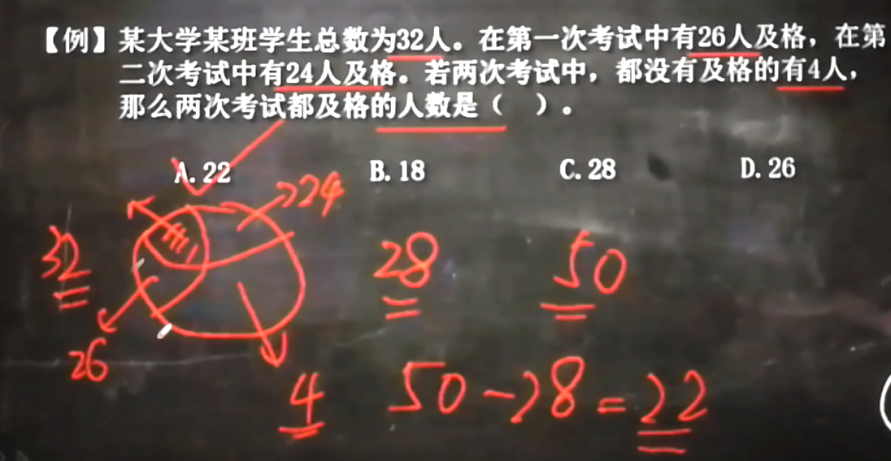
    - 第一次考试人数+第二次考试人数=26+24=50人，这里面重复计算了都及格的人数。有4人都不及格，则都及格的人数为32-4=28，则两次都及格（图中阴影部分）50-28=22

### 二集合容斥 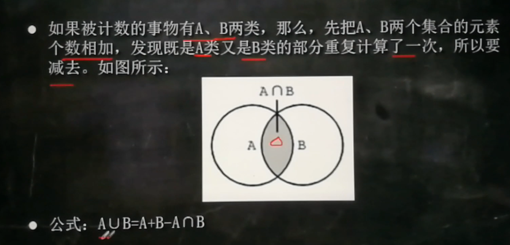
### 三容斥原理 
+ 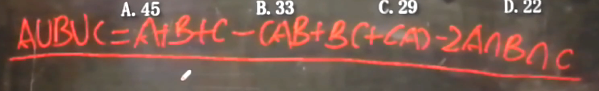
    - 三集合容斥非标准公式 AB+BC+CA 表示只有AB的不包括ABC的
+ 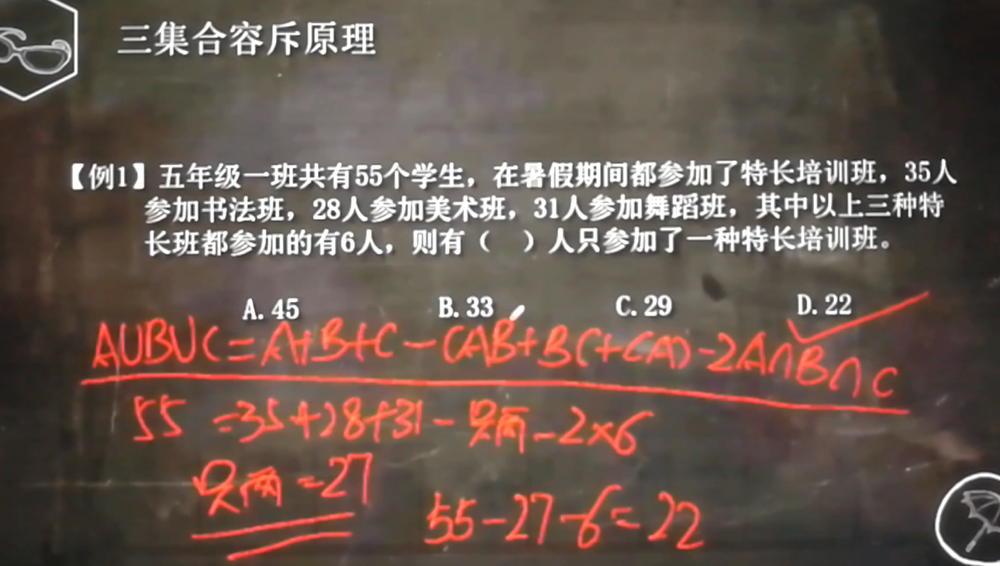
+ 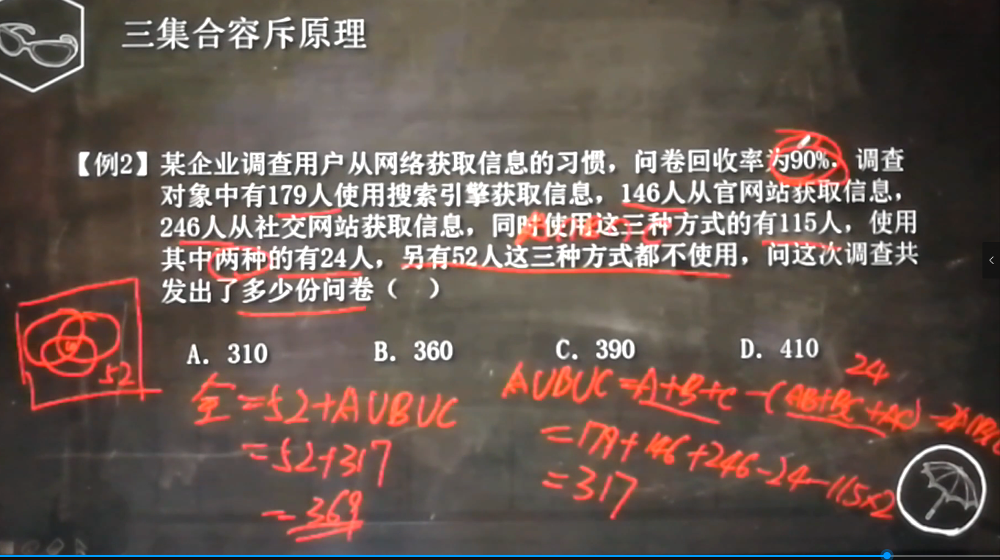
+ 
    - 根据三容斥原理测算出AuBuC=A+B+C-(AnB+BnC+AnC)+AnBnC 即55=35+28+31-x+6，x=45，这个x就是参加两种特长班以上（包含三个特长班都报名的）人数，那么只报名两个特长班的为x-3*6=45-18=27，那么只参加一种的就是55-27-6=22

## 比例问题
+ 概述：工程问题，浓度问题，牛吃草问题
+ 方法：代入排除法、赋值法、十字交叉法

### 十字交叉法（比例是相反的！！！）
+ 
+ 溶液混合问题、平均数混合问题和利润混合问题，增长率混合问题
+ 利润问题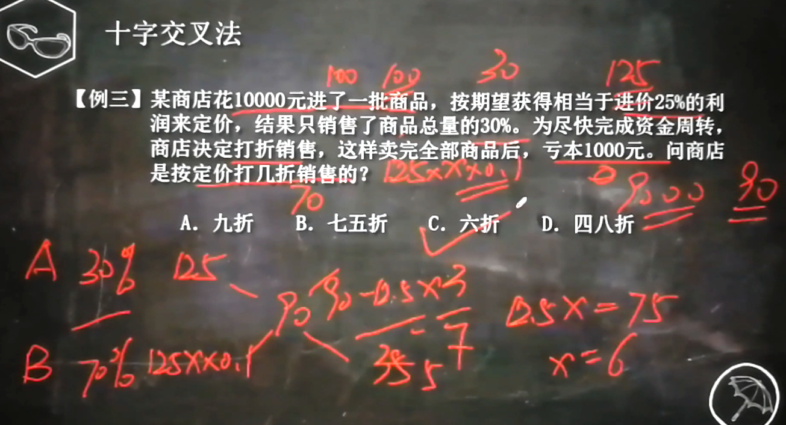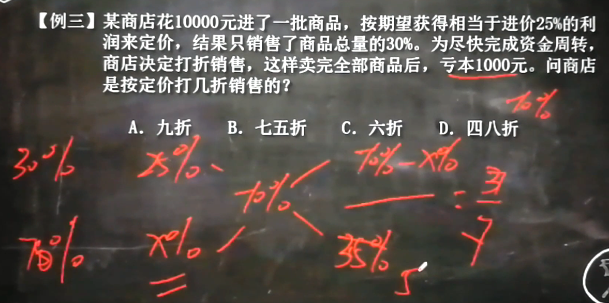
    - 方法一：方程法，设有100件商品，则有30*125+70*125*x=9000，解得x=0.6
    - 方法二：十字交叉法，混合前30%商品为 125,70%商品为125*x，混合后为90元。则有3/7=90-125*x/35，得x=0.6
    - 方法三：混合利润，混合前30%利润为25%，70%利润为x%，混合后利润为-10%，则有3/7=（-10%-x%）/35%，的x=-25%。则打折后售价为0.75。0.75/1.25=0
+ 三溶液混合

### 工程问题（工作总量=工作效率*工作时间，常用方法：赋值法）
+ 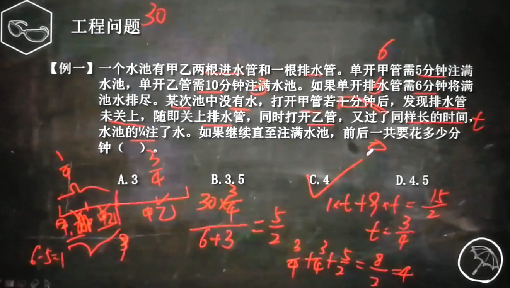
    - 设总工作量为30a （单开5，单开10，单排6的最小公倍数），那么甲开效率为30a/5=6a，乙开效率为30a/10=3a，排出效率为30a/6=5a。先计算后3/4部分的用时30a*0.75/（6a+3a）=2.5。设前面若干用时为x，则分两个阶段，第一阶段为甲开单排效率为6a-5a=1a，第二阶段为甲开乙开效率为6a+3a=9a，则有1a*x+9a*x=30a*0.25，x=0.75，则总用时为0.75*2+2.5=4
+ 
    - 有工作时间，就能求出工作效率，设工作总量为30a（10,15的最小公倍数），则甲的工作效率为3a，乙的工作效率为2a，由线段分析乙休息了5/3相当于甲单独做了5/3小时。3a*（5/3）=5a，剩余由甲乙共同完成25a/（3a+2a）=5小时，在这5小时中，甲比乙多做了5*（3a-2a）=5a，则统共甲比乙多做5a+5a=10a=300。则a=30。30a=900
+ 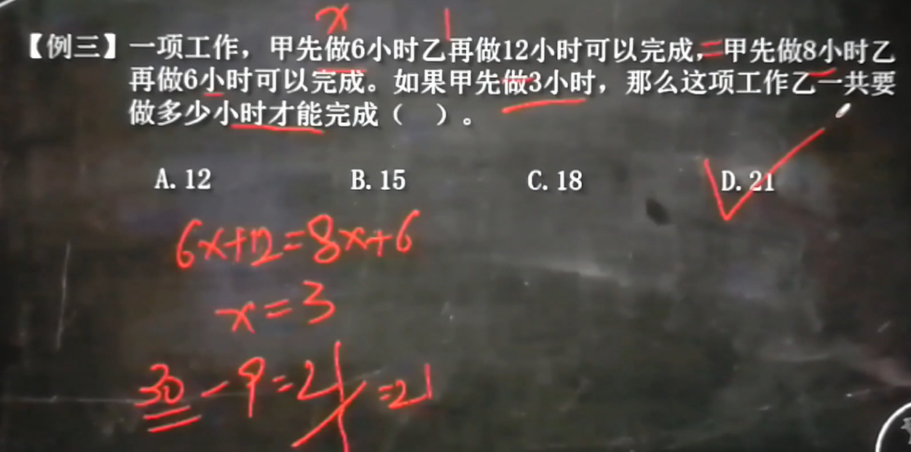
    - 设甲工作效率为x，设乙工作效率是1，则有6x+12=8x+6，x=3，则总工作量为6*3+12=30,30-9=21

### 浓度问题
+ 溶液质量=溶剂质量+溶质质量
+ 浓度=溶质质量/溶液质量
+ 常用方法：十字交叉法、赋值法
+ 
    - 这个过程中溶剂水质量没有变，12*0.8=9.6，当浓度变为0.25时，可以计算出加入糖后溶液质量9.6/0.75=12.8，则加入了0.8克糖，所以共加入了2.4+0.8=3.2糖
+ 
    - 十字交叉法求解：A 10%  100，B 50% x，混合后为25%。则有100/x=25/15，得x=60，则60/14=4.多。所以有5次

### 牛吃草问题
+ 
    - 牛吃草问题实际也是工程问题，只是草一直在生长，所以要计算出草的生长效率。一般设牛的效率为1.则有10*20-15*10=50.这就是10天插值的长草量。所以每天长草量为50/10=5
+ 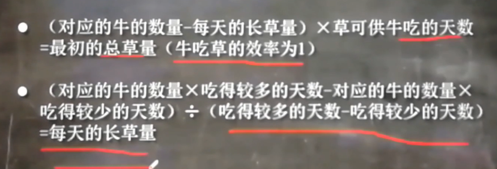
    - 
        * 利用公式一：最初的总草量=（牛的数量-每天长草量）*天数。设每公顷草x，每天长草y，设牛吃草效率为1。则有（11-5y）*10=5x
    - 
        * 这道题的关键是，计算出每天的河沙沉积量，也就是牛吃草的变种。

## 行程问题
+ 
+ 
    - 此题有比例，有时间和路程，还有长跑的速度，则算出长跑的时间，就能算出总时间。全程是51.5，则游泳、自行车、长跑分别为1.5,40，10.长跑时间为10/15=2/3.长跑时间占总时间的4/15.则总时间=2/3除以4/15
+ 
    - 画线段解题，下坡时AC段用时1小时，则BC段用时也是1小时。上坡时，BC段用时2小时，则速度之比为v上：V下=1:2。设上坡速度为v，则下坡速度为2v，那么就有AC段距离=BC段，及（v+3.6）*1.5=V*2（1米每秒，等于3.6千米每小时）

### 相遇问题
+ 
+ 
    - 找到相遇的次数是关键。a汽车第二次从甲地出发后与b车相遇，根据线段图可知，相遇三次。所有行驶的总路程为（2*3-1）*210。两车的速度之比为3:4，在总路程中b车占4/7
+ 
    - 画图搞清楚行驶过程。设第一次相遇用时t。则t时间，甲车走了100千米。第二次相遇，根据公式2*2-1=3t。则第二次相遇时，甲车一共走了300千米（1t=100千米），此时甲车距离A有80千米。由图可知，甲走了1个来回路程为380千米，所以AB相距190千米
+ 
    - 设小王速度是v1，小刘速度是v2，1小时相遇，则甲丙刚好是v1，乙丙刚好是v2。

### 环形相遇
+ 
+ 
    - 画图理解，本题是一次环形相向和一次环形背向，1次相向相遇时小明走了3*（400/8）=150m，一次背向相遇小明走了3*（400/2）=600米。根据公式，走了15*（150+600）=11250
+ 
    - 同向速度差，背向速度和

### 追及问题
+ 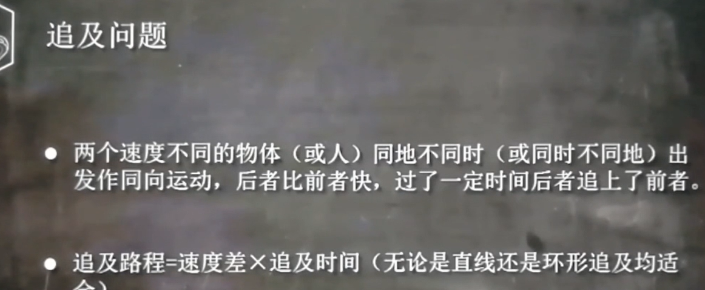
+ 
    - 画图理解过程。此题关键是求出路程差。乙比甲早走2小时，则路程差为48
+ 
    - 此题关键是读懂问题，问的是出发地相距多远而不是追击距离。设甲的速度为v1，乙速度为v2，则有10v2-11v1=250。v2-v1=400/8=50，追了两分钟，追击距离为100。所有两人出发地相距250-100

### 火车过桥
+ 
+ 
+ 速度和等于两车长除以时间，根据速度比，可知速度和为8份，则速度差为2份

### 行船问题
+ 
+ 
    - 设水速为v，则有3V顺-4V逆=10，即3（32+v）-4（32-v）=10

## 利润问题
+ 
+ 
    - 盈利多少就是利润率是多少
+ 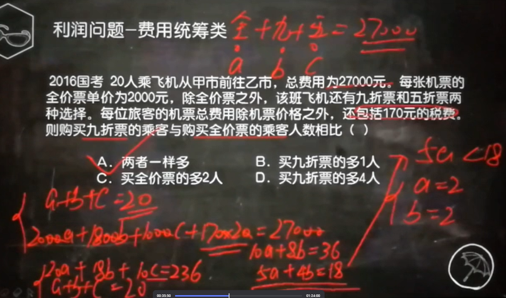
    - 不定方程求解问题，利用数字特性。5a+4b=18，a和b都是整数，则a=2，b=2.
+ 
    - 谁用时间最短任务就交给谁做
+ 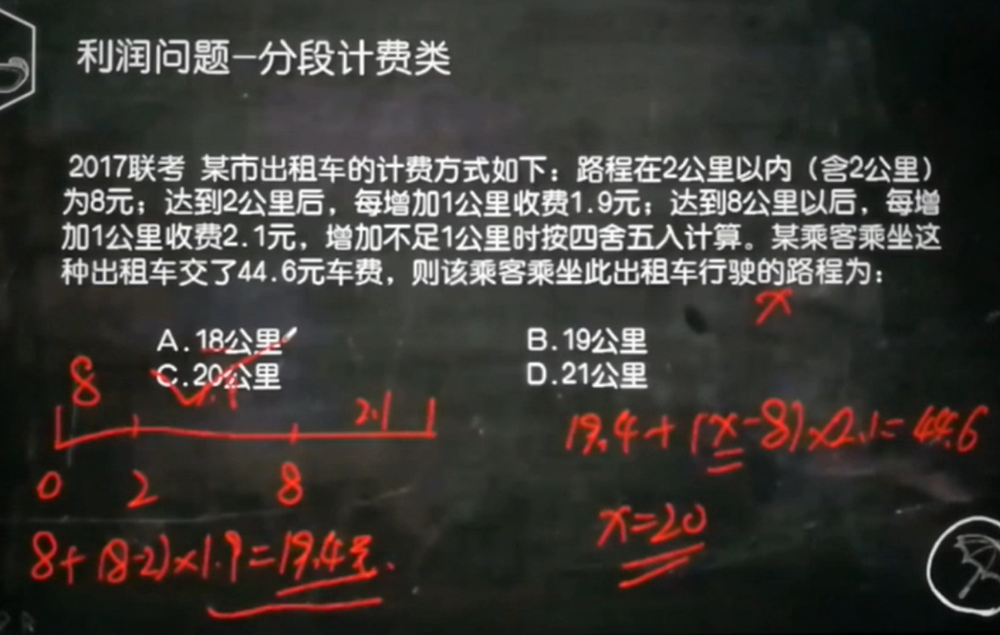

## 时钟问题
+ 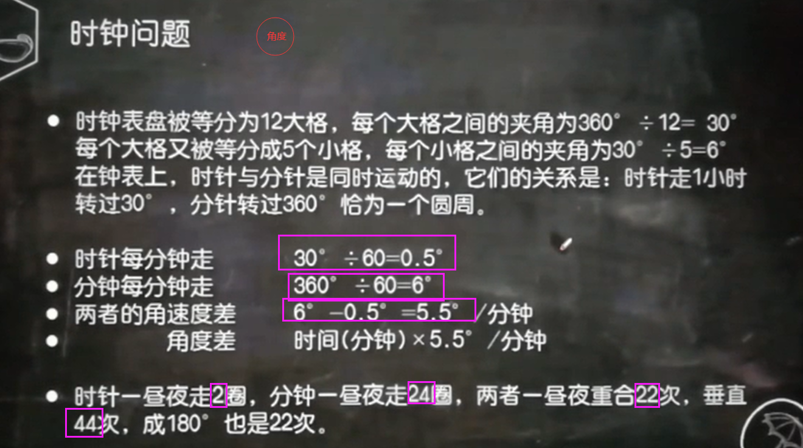
+ 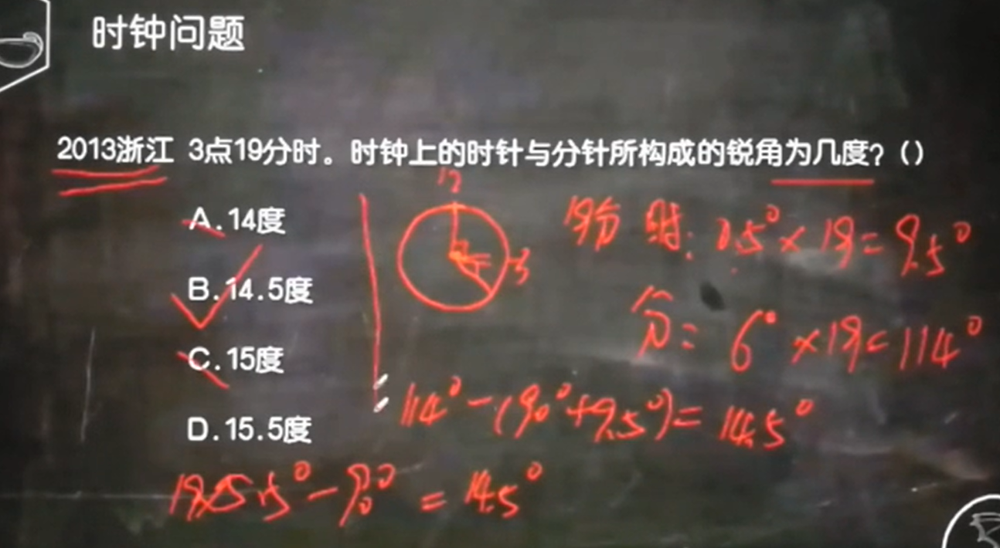
    - 方法一：时针一分钟走0.5，分针一分钟走6。以12点为基线，则3：19时，时针度数为90+19.5*0.5=99.5，分针走了6*19
    - 方法二：时针分针角度差为5.5，则有19*5.5-90=14.5
+ 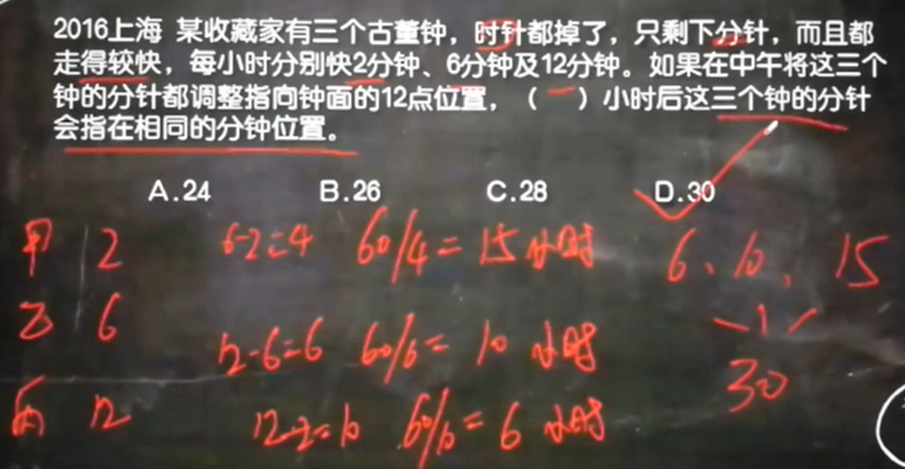
    - 转换为环形追击问题。找出速度差，算出相遇时间，然后求他们的最小公倍数

## 年龄问题
+ 
+ 
    - 设姐弟年龄之和为x，则2000年是，妈妈为4x，2006时姐弟年龄之和为x+12，此时妈妈为4x+6

## 日期问题
+ 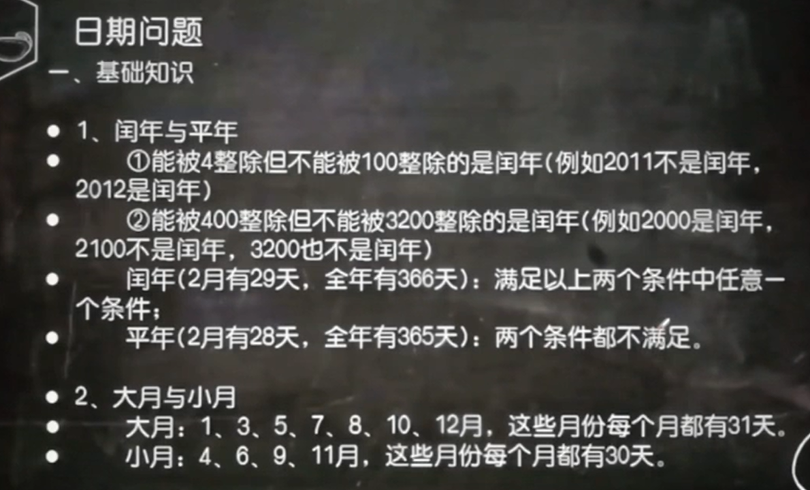
+ 
+ 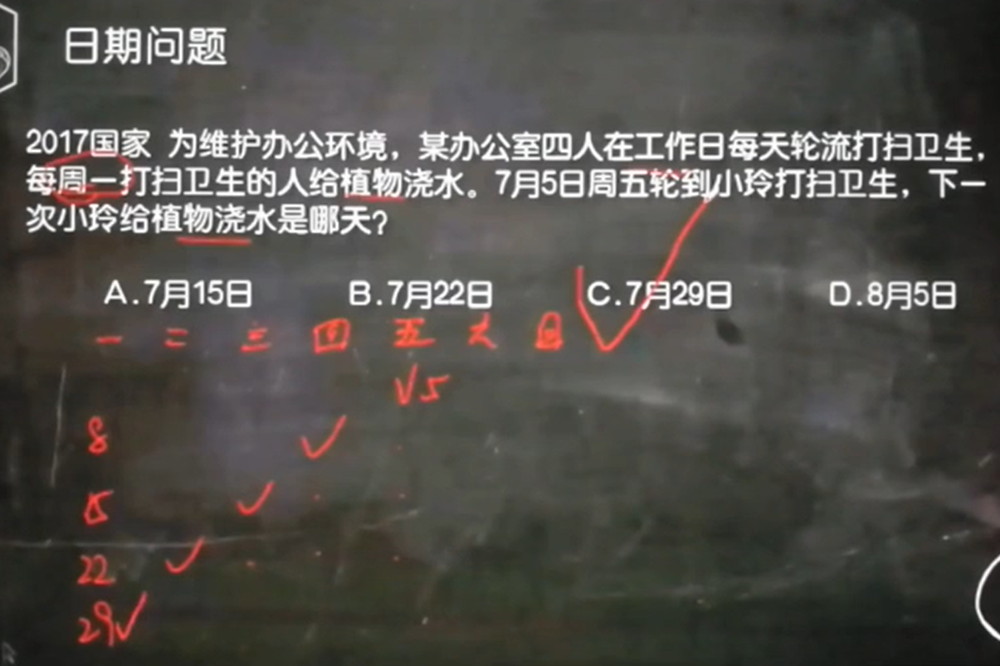
    - 画日期表格

# 4 资料分析
一定要拿到分

## 常见术语及相关公式
### 常见术语
+ 基期A（统计基数，期限）
+ 现期B（现在时期）
+ 增长量X=B-A
+ 增长率m%是增长量与基期量的比值，又称为增幅、增速
    - 
    - $ \begin{align}
\ m \%= \frac{B-A}{A}*100 \%=(\frac{B}{
A}-1)*100\%
\end{align} $
    - 
    - 
    - $ \begin{align}
\ A = \frac{B}{1+m \%}
\end{align} $
    - 
    - 
    - m%化为1/n则有A=B*n/(1+n) 和X=B/(1+n)
    - 
    - 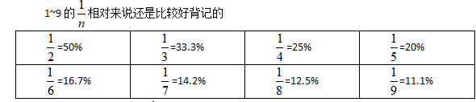
    - $ \begin{align}
\ B = A*(1+m \%)
\end{align} $
    - 
    - $ \begin{align}
\ m \%= \frac{X}{B -X}*100 \%
\end{align} $
    - 
    - 
+ 同比增长（本期发展水平与去年同期发展水平）还是一个增长率
+ 
+ 环比增长（本期发展水平与上期（紧挨着的那一期））
+ 
+ 百分数
+ 
+ 百分点是指不同时期以百分数形式表示的相对的变动幅度
    - 如去年物价上涨了10%，今年物价上涨了8%，今年物价上涨幅度比去年下降了2个百分点
+ 
+ 
+ 倍数与翻番
    - 倍数成倍的变化（A是B的3倍，等价于A比B多2倍）
    - 翻番 A翻n番=A*2^n
+ 比重
    - 比重是某部分在总体中所占的百分比，假设总量为A，分量为B，分量展总量比重为x% 
    - $ \begin{align}
\ x \%=\frac{B}{A}*100\%
\end{align} $
    - 
    - 现期A分量，增长率为a%，现期总量B，增长率为b%，则基期比重为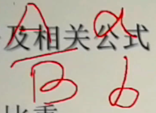
    - 
    - 现期比重与基期比重相比，增长（降低）了
    - 
+ 贸易顺差、贸易逆差和贸易平衡
    - 在特定年度一国出口贸易总额大于进口贸易总额
    - 在特定年度内进口贸易总值大于出口总值
    - 贸易平衡是指进出口基本平衡
+ 基尼系数与恩格尔系数
    - 基尼系数常用来衡量居民收入差距程度。基尼系数越大，表示不平等程度越高。衡量贫富差距
    - 恩格尔系数是指食品支出占消费总支出的百分比。**恩格尔系数是衡量一个**家庭**或一个**国家**富裕程度的主要标准之一**。一般来说，在其他条件相同的情况下**，恩格尔系数较高，作为家庭来说则表明收入较低，作为国家来说则表明该国较穷。反之，恩格尔系数较低，作为家庭来说则表明收入较高，作为国家来说则表明该国较富裕**。
+ GDP和GNP
    - GDP：一个国家范围内，常住居民在一定时期内生产的产品和服务的价值
    - GNP：一个国家所有国民在一定时期内生产的产品和服务的总和，包括本国公民在国外的生产价值

## 常见速算方法
### 首尾数法
+ 首数法
    - 应用原则：选项的首位或前两位数字各不相同
    - 是指运算结果的首位数字或前两位、三位数字来确定选项。一般用于除法
+ 尾数法
    - 应用原则：选项的尾数各不相同，列式为简单的加减乘法运算
    - 尾数可以指结果最末一位或者几位数字

### 有效数字法
+ 应用原则：
    - 一般在第3位有效数字上四舍五入。当遇到5或者接近5的数字时，减除法取舍时同向变化，加乘取舍时反向变化。
    - 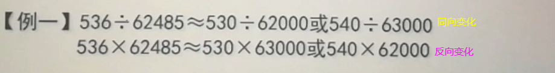
    - 加减法取舍时一般至少留3位
    - 分数比较大小，分母相同，分子大的分数值大，分子相同分母大的分数值越小

### 百分数转化分数法
+ 现期A a 基期B B=A/(1+a)   a=1/n  B=A/(1+n)

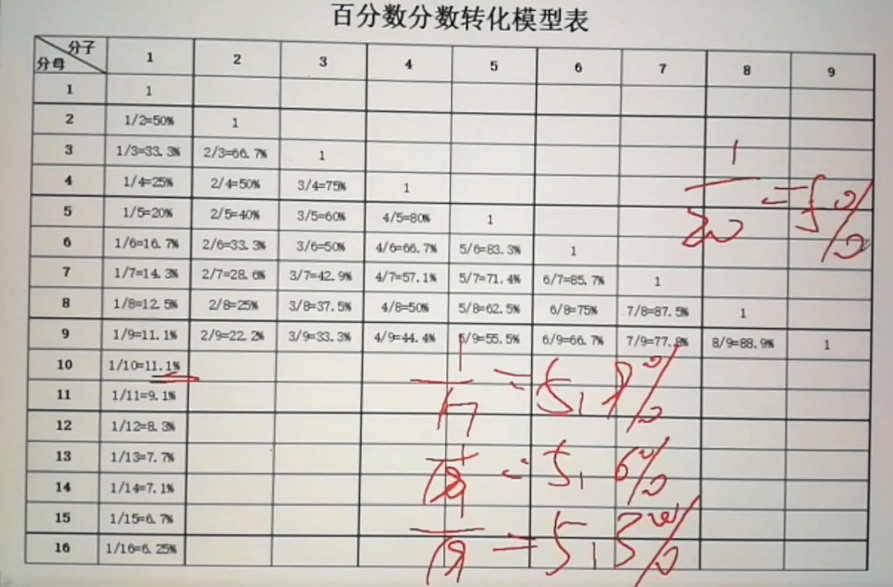

### 乘除转换法（加减变换）
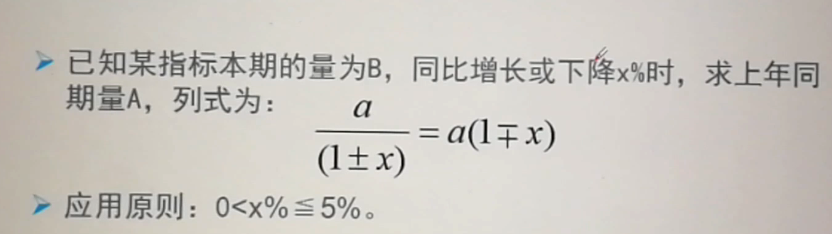

### 放缩法

放缩法要结合有效数字法

### 分数比较法
+ 分母相同，分子大则大；分子相同，分母大则小
+ 分子大分母小，一定大
+ 
+ 插值法（中间值）
+ 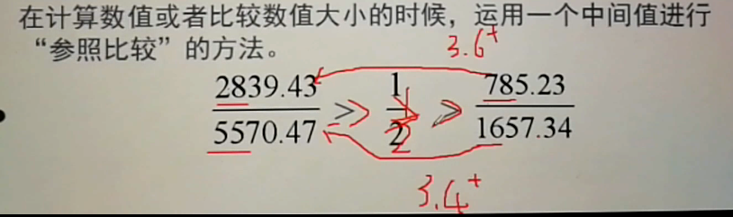

## 常见题型解析 
### 文字型
+ 30-60 标记主旨，找关键

### 表格型
+ 15-30 表头、单位、注释

### 图形型
+ 10-30 陷阱、背景

### 混合型
+ 40-60 材料之间的关联性

### 直接查找型
+ 正确理解题意，快速找到答案
+ 快速定位，精准选择
+ 一定要细心！！！

### 计算型
+ 数学运算，加成，减除
+ 必须使用速算技巧
+ 次位差大于首位，则截两位进行除
+ 次位差小于首位的，则截三位进行除
+ 
+ 首数都不一样时候，用首数法（加乘减）
+ 尾数都不一样时候，用尾数法（主要是除法）
+ 带入排除法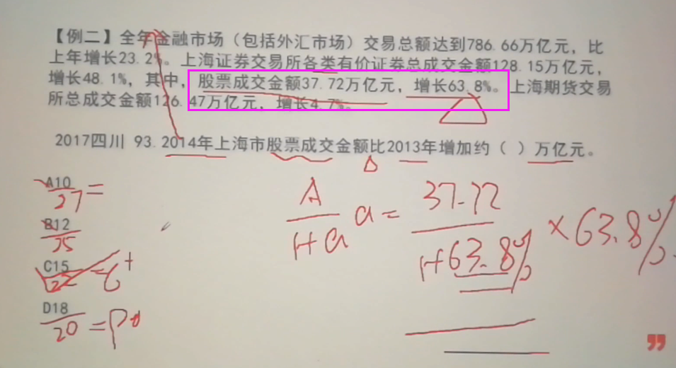    

### 混合增长率问题(混合浓度问题)
+ 根据混合增长率口诀,整体增速介于各个部分之间（平均值）,偏向基数较大的一方 
+ 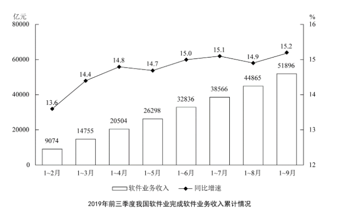
+ 十字交叉法：6.3/6422  4.4/3272

### 间隔增长率
r=r1+r2+r1*r2（r为间隔一期增长率，r1，r2为连续两期增长率）

### 年均增长率
r=(n根号A/B)-1

A=B(1+r)^n   (r<10%时，B（1+n*r）

年均增长量=（A-B）/N

### 贸易顺差
+ 顺差=出口-进口
+ 顺差=进出口总额-2*进
+ 顺差=2出-进出口总额

### 平均数
每字后面是除数，的字后面是被除数

平均数的增长量   A被除数，B是除数（每字）

平均数的增长率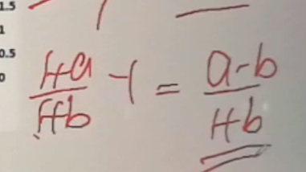a为除数（增长率），b是除数

### 比较型题目
一般都是比较大小，或者判断正误

方法：

+ 逐一计算
+ 作差
+ 坐商
+ 中间值
+ 两两比较排除法

### 正误判断（能从资料推出，一般答案是C或者D）
先计算简单的

先看字数少的 

